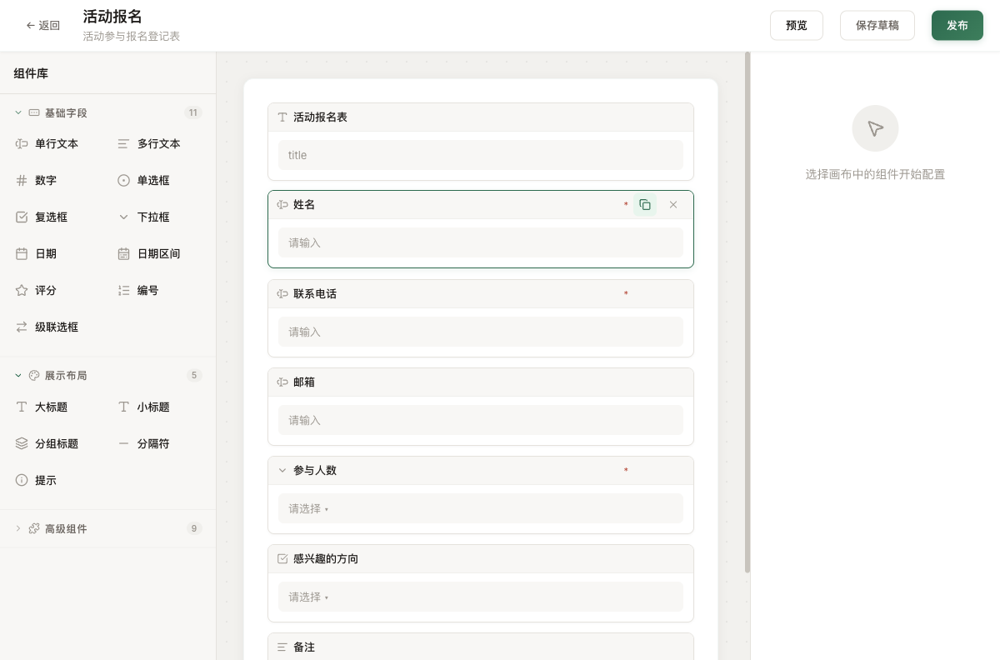

<p align="center">
  
</p>

<h1 align="center">FormCenter</h1>

<p align="center">
  <b>搭表单就像发朋友圈。<br/>拖一拖，发链接，收数据。完事。</b>
</p>

<p align="center">
  
  
  
  
  
</p>

<br />

<p align="center">
  
</p>

---

## 三步，就三步

|     | 你做什么             | 系统做什么                     |
| --- | -------------------- | ------------------------------ |
| ①   | 拖拽组件搭表单       | PC / 移动端自动适配，实时预览  |
| ②   | 点复制分享链接       | 填写者扫码或打开链接就能填     |
| ③   | 查看数据，导出 Excel | 数据本地存储，一键导出         |

不注册。不付费。不上传服务器。

---

## 给谁用的

HR 收简历、行政做登记、销售搞调研、老师发问卷。

**一句话：任何需要"让别人填个表"的场景。**

---

## 凭什么选它

| 😰 担心           | 😎 回答                                       |
| ----------------- | --------------------------------------------- |
| 要学吗？          | 不用。拖就完了。                              |
| 要装什么？        | 一个浏览器。就一个浏览器。                    |
| 数据安全吗？      | 全在你电脑里，不经过任何服务器。              |
| 收费吗？          | 免费，MIT 开源。今天免费，明天也免费。        |
| 手机能用吗？      | 填写页专为手机优化，Vant 4 组件原生体验。     |
| 没网了？          | 照样用。离线数据全在本地。                    |

---

## 组件

**26 种表单组件**，覆盖全部常用场景：

| 类别   | 组件                                       |
| ------ | ------------------------------------------ |
| 输入   | 单行文本 · 多行文本 · 数字 · 自动编号      |
| 选择   | 单选框 · 复选框 · 下拉框 · 级联选择        |
| 日期   | 日期 · 日期区间                            |
| 文件   | 文件附件 · 图片上传 · 手写签名             |
| 评分   | 星级评分                                   |
| 高级   | 表格 · 交叉表 · 关联查询 · 承诺说明 · 树结构 |
| 装饰   | 大标题 · 小标题 · 分组标题 · 分隔符 · 提示 |
| 其他   | 二维码                                     |

---

## 快速开始

```bash
npm install && npm run dev
```

浏览器打开 `http://localhost:3000`，拖拽组件开始设计。

---

## 技术栈

Vue 3 · TypeScript 6 · Vite · Element Plus · Vant 4 · Pinia · Lucide Icons

<p align="center">纯前端 · 纯开源 · 纯 MIT</p>
